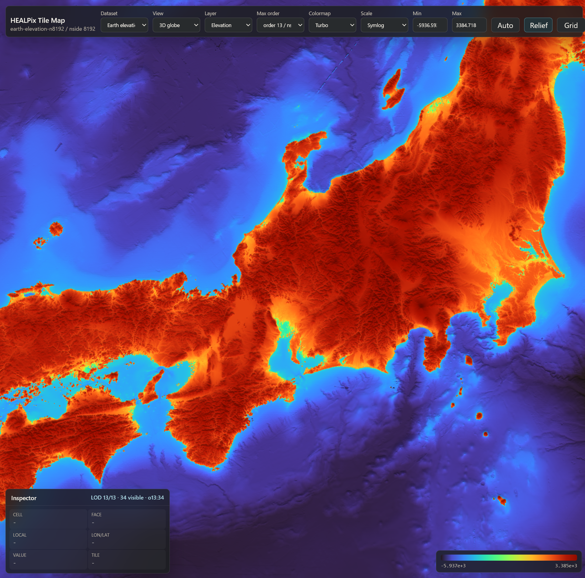

# HEALPix Tile Map Viewer

High-resolution web tile map viewer for HEALPix scalar data on spherical surfaces.

This repository contains the viewer, tile generators, notebook helpers, and MCP
server. It does not contain generated tile pyramids or DEM source data. A new
user must generate or convert local datasets before the map can show data.



## Features

- `hpxmap-v1` directory tile format for HEALPix scalar maps.
- 2D unfolded HEALPix net and 3D Three.js globe views.
- Zoom-driven LOD selection with parent-tile fallback.
- Float32, uint16, and int16 scalar tiles.
- Shader-side colormap, min/max, linear/log/symlog scaling, and relief shading.
- Camera/view-state panel with reusable `view_state.json`, copyable
  JSON/URL/Python, globe coordinate axes, graticule, scale bar, PNG/JPG export,
  and headless `hpxviewer-export` rendering.
- Hover inspector for HEALPix cell, face-local coordinates, lon/lat, value, and
  source tile.
- Right-drag tile painting. The viewer returns compact HEALPix `tileRanges` and
  `cellRanges`, not point probes.
- Notebook helper for opening the viewer, receiving selections, and slicing
  selected cells from NESTED HEALPix arrays.
- Optional MCP server for language-model driven viewer control and screenshots.

## Repository Layout

```text
src/                  web viewer
src/wasm/             WAT source for the optional tile decoder
tools/                dataset generators and converters
python/hpxviewer/     notebook and analysis helpers
mcp-server/           optional MCP server
public/datasets/      local generated datasets; ignored by git
data/                 local source rasters and input arrays; ignored by git
```

## Prerequisites

- Node.js and npm.
- Python 3.11 or newer.
- Enough local disk for generated data.
  - `spectral-noise-n8192` is about 4 GiB.
  - `earth-elevation-n8192` is about 2 GiB after quantization, plus the ETOPO
    source download.
- For procedural spectral noise: `healpy`.
- For Earth DEM generation: `rasterio` and its GDAL runtime.
- For converting custom Zarr stores: `zarr>=3`.
- For notebooks: Jupyter and IPython.

Clone the repository:

```sh
git clone <repo-url>
cd healpix-tile-map-viewer
```

Install the JavaScript and Python dependencies:

```sh
npm install
pip install -e "python[all]"
```

If you only want the web viewer and will not generate data on this machine,
`npm install` is enough.

## Dataset Directory

Generated datasets are local artifacts and are ignored by git:

```text
public/datasets/<dataset-id>/
public/datasets/index.json
data/
```

`public/datasets/index.json` is the dataset selector index. The generator
scripts register datasets automatically. The expected shape is shown in
`public/datasets/index.example.json`.

## Generate Spherical-Harmonic Spectral Noise

This creates the procedural test field used for high-resolution LOD, seam, and
tile-selection checks. The generated field is a deterministic scalar
spherical-harmonic random field. It draws `a_lm` coefficients and fixes the
realized degree energy

```text
E_l = sum_m |a_lm|^2
```

to be proportional to `l^-5/3`. In healpy's angular-power convention this is
`C_l = E_l / (2l + 1)`. Lower pyramid orders use the same realization truncated
to the order's `lmax`.

Generate and register the nside 8192 dataset:

```sh
npm run generate:spectral:8192
```

The output is:

```text
public/datasets/spectral-noise-n8192/
```

Tile counts for `tileSize=256`:

```text
order 11:   768 tiles
order 12:  3072 tiles
order 13: 12288 tiles
total:    16128 tiles
```

## Generate Earth Elevation From ETOPO 2022

The Earth elevation recipe uses NOAA ETOPO 2022 15 arc-second surface elevation.
The downloader fetches 288 source tiles and builds a local VRT:

```sh
npm run download:etopo2022:15s
```

This writes:

```text
data/ETOPO2022_15s_surface/
data/ETOPO2022_15s_surface/ETOPO_2022_v1_15s_surface.vrt
```

Generate and register the nside 8192 HEALPix tile pyramid:

```sh
npm run generate:earth:8192
```

The output is:

```text
public/datasets/earth-elevation-n8192/
```

The package script writes uint16 quantized tiles using:

```text
value = encoded * scale + offset
quantize-min = -12000
quantize-max = 9000
```

The generator samples the raster with periodic longitude, clamped latitude, and
bicubic interpolation. Different global DEM rasters can be used by calling
`tools/make_earth_elevation.py` directly with `--source`. The generated manifest
sets `body.radiusKm` to Earth's mean radius, so globe scale bars are labeled in
physical distance.

## Run The Viewer

After at least one dataset has been generated:

```sh
npm run dev
```

Open:

```text
http://127.0.0.1:4181/
```

If no dataset index exists, the viewer opens an empty-state page with the data
generation command instead of failing.

Useful checks:

```sh
npm run test
npm run build
npm run validate:generated
```

`npm run test` does not require generated datasets. `validate:generated` checks
tile files under `public/datasets/*/manifest.json`.

## View State And Figure Export

The toolbar `View` button opens a panel for camera and figure controls. In the
3D globe view, the panel shows the camera position, target, current center
longitude/latitude, and the center HEALPix/geographic vector. Enter `Lon`,
`Lat`, `Distance`, and `FOV` to set the camera; the fields apply on Enter or
when the field changes focus. `FOV` is limited to `179.9` degrees because an
exact 180-degree perspective projection is singular.

`JSON` copies the current view state, and `URL` copies a shareable URL that
includes dataset, layer, order, colormap, scale, camera, axes, graticule, scale
bar, north-up, split layout, and panel state. Paste edited JSON into the panel
and press `Apply JSON` to restore a view.

`Save JSON` writes the same state as a standalone scene file. The file uses
`schema: "healpix-tilemap.view-state.v1"` and includes the active pane, split
mode, overview/footprint state, per-pane dataset/layer/color/camera settings,
net pan/zoom transforms, and export options such as target pane, output scale,
width/height, transparency, and metadata embedding. `Load JSON` reads such a
file back into the viewer, so a saved `view_state.json` is the preferred way to
reproduce a figure setup.

`Python` copies a notebook-ready snippet using the existing helper API:

```python
from hpxviewer import Viewer

v = Viewer(
    "earth-elevation-n8192",
    layer="elevation_m",
    view="globe",
    order=13,
    cmap="turbo",
    scale="symlog",
).set(
    camera="...",
    axes=True,
    graticule=True,
)
v.show()
```

The `Axes` toolbar button overlays `+X/-X`, `+Y/-Y`, and `+Z/-Z` axes in the
viewer-facing Z-up coordinate system. `+Z` points to the north pole. The
low-level projection code stores spherical vectors internally with the second
component as north, but the UI, camera panel, copied view state, and axis labels
use display XYZ with `+Z` north to avoid exposing that implementation detail.

Additional globe overlays:

```text
North     checkbox; keep local geographic north oriented upward at the view center
Graticule checkbox; draw longitude/latitude guide lines
Scale     checkbox; show a dataset-aware scale bar at the view center
```

The scale bar uses `manifest.body.radiusKm` when present. Datasets with a
physical radius are labeled in `km`/`m`; datasets without one are labeled in
angular distance (`deg`, `arcmin`, or `arcsec`) so the viewer does not imply an
Earth-sized body for abstract maps.

The `Save Image` button opens an export dialog where the file name, format,
target, output scale, explicit width/height, PNG transparency, and metadata
embedding can be confirmed before saving. The export dialog writes local files
from the current view:

```text
Active pane          active pane plus colorbar
Left / top pane      left or top pane plus colorbar
Right / bottom pane  right or bottom pane plus colorbar
Split panes          both panes as one figure
```

PNG and JPG exports support 1x, 2x, and 4x output scale. Set `Width` and/or
`Height` to force an exact output size; blank fields use the current canvas size
times the selected scale. The export dialog's `Transparent PNG` option removes
the viewer background color from PNG output. `Embed metadata` stores the
dataset, layer, camera, and view-state JSON inside PNG `iTXt` metadata or JPG
XMP.

The Python helper can save a figure without showing a browser window. It starts
or reuses the local viewer server, opens the viewer in headless Chrome, and uses
the same export path as the interactive dialog:

```python
from hpxviewer import Viewer

v = Viewer(
    "earth-elevation-n8192",
    layer="elevation_m",
    view="globe",
    order=13,
    cmap="turbo",
    scale="symlog",
).set(
    axes=True,
    north=True,
    graticule=True,
    scalebar=True,
    camera="1.701158,0.085457,2.857535,0.628908,-0.634961,2.287902,175.4",
)

v.save_image(
    "earth-elevation.png",
    mode="active",
    width=1800,
    height=1200,
    embed_metadata=True,
)
```

For reproducible figures, save the current scene from the viewer with
`View` -> `Save JSON`, then render that file without opening the interactive UI:

```sh
hpxviewer-export view_state.json figure.png
```

The command starts or reuses the local viewer server on `127.0.0.1:4181`, opens
the saved state in headless Chrome, waits for tiles to settle, and writes the
same PNG/JPG output path used by the interactive export dialog. Export settings
stored in `view_state.json` are honored by default. Override them when needed:

```sh
hpxviewer-export view_state.json figure.png \
  --mode split \
  --width 2400 \
  --height 1400 \
  --scale 2
```

Use `--base-url http://127.0.0.1:4181/` when a viewer server is already running
at a specific URL. `save_image()` and `hpxviewer-export` require Chrome or
Chromium on the machine running Python. Set `CHROME_BIN=/path/to/chrome`, pass
`chrome=...`, or use `hpxviewer-export --chrome /path/to/chrome` if it is not on
`PATH`.

## Notebook Workflow

Install the Python helper in the same environment as the Jupyter kernel:

```sh
pip install jupyterlab
pip install -e "python[analysis,notebook,array]"
```

Start Jupyter on the machine that also has the generated datasets:

```sh
jupyter lab --no-browser --ip 127.0.0.1 --port 8888
```

Start the viewer from a notebook:

```python
from hpxviewer import Viewer

v = Viewer(
    "spectral-noise-n8192",
    view="globe",
    order=13,
    cmap="turbo",
    scale="symlog",
)
v.show(iframe=False)
```

Open the displayed link in a separate tab. The tab posts selection updates back
to the original notebook output panel.

Point selection:

```python
selection = v.selection(timeout=30)
selection["selectionType"]
# "point"
```

Tile painting selection:

```python
tiles = v.tile_selection(timeout=30)
tiles.to_dataframe("cell_ranges", order=13)
tiles.to_dataframe("nested_ranges", order=13)
```

If you have a full-sphere NESTED HEALPix array at the same order:

```python
values = tiles.values_from_nested(my_nested_map, order=13)
values.mean(), values.min(), values.max()
```

For the recommended Zarr layout `(..., block, cell)`, keep the Zarr array open
and pass leading-axis indices with `prefix`:

```python
import zarr

temperature = zarr.open_group("data/my-map-n8192.zarr", mode="r")["temperature"]
values = tiles.values_from_block_cell(temperature, order=13, block_order=11, prefix=(0,))
values.mean()
```

For very large selections, avoid concatenating values:

```python
for row in tiles.nested_id_ranges(order=13):
    chunk = my_nested_map[row["start"]:row["stop"]]
    # analyze chunk
```

## SSH Port Forwarding

When Jupyter and the viewer run on a remote processing machine and the browser
is on another machine, forward both ports from the browser machine:

```sh
ssh -N \
  -L 8888:127.0.0.1:8888 \
  -L 4181:127.0.0.1:4181 \
  user@processing-host
```

Run Jupyter on the processing machine:

```sh
jupyter lab --no-browser --ip 127.0.0.1 --port 8888
```

Open locally:

```text
http://127.0.0.1:8888/
```

In the notebook, use the normal local viewer URL:

```python
Viewer("spectral-noise-n8192", base_url="http://127.0.0.1:4181/").show()
```

If the local forwarded viewer port is different, use that local browser URL in
`base_url`.

## Convert Your Own HEALPix Data

Use `tools/make_hpx_tiles.py` when your data is already a full-sphere HEALPix
scalar array. The recommended input format for large custom datasets is a Zarr
v3 store. Zarr groups can contain multiple variables and leading axes such as
time; the converter writes one selected variable/time slice to one `hpxmap-v1`
tile pyramid.

Preferred selected array layouts:

```text
(12 * nside_block**2, (nside / nside_block)**2)        block, cell
(time, 12 * nside_block**2, (nside / nside_block)**2)  time, block, cell
(12, nside, nside)                                      face-local row-major grid
```

The `block` axis is the global HEALPix NESTED id at `block_order`, where
`nside_block = 2**block_order`. The `cell` axis is the local NESTED subcell id
inside that block. The old-looking shape `(12, nside**2)` is just this same
format with `nside_block=1` and `block_order=0`. Extra axes must be selected
with `--select` before conversion.

Example Zarr v3 input store:

```python
import zarr

nside = 8192
block_order = 11
nside_block = 2**block_order
sub_nside = nside // nside_block
root = zarr.open_group("data/my-map-n8192.zarr", mode="w", zarr_format=3)
temperature = root.create_array(
    "temperature",
    shape=(4, 12 * nside_block * nside_block, sub_nside * sub_nside),
    chunks=(1, 65_536, sub_nside * sub_nside),
    dtype="float32",
)
temperature.attrs["_ARRAY_DIMENSIONS"] = ["time", "block", "cell"]

# Fill the store chunk by chunk from your pipeline.
# temperature[time_index, block_start:block_stop, :] = values
```

Convert one variable and one time index:

```sh
npm run convert:hpx -- \
  --input data/my-map-n8192.zarr \
  --array temperature \
  --select time=0 \
  --block-order 11 \
  --output public/datasets/my-map-n8192 \
  --dataset-id my-map-n8192 \
  --title "My map nside 8192" \
  --layer-id value \
  --layer-title "Value" \
  --ordering nested \
  --min-order 11 \
  --tile-size 256 \
  --default-view globe \
  --colormap viridis \
  --scale symlog \
  --body-name Earth \
  --body-radius-km 6371.0088 \
  --force
```

Omit `--body-radius-km` for abstract spherical maps. The viewer will then show
scale bars in angular units rather than physical distance.

If the Zarr array does not store dimension names, provide them explicitly:

```sh
  --dims time,block,cell \
  --select time=0
```

Register it in the dataset selector:

```sh
npm run register:dataset -- \
  --id my-map-n8192 \
  --title "My map nside 8192" \
  --manifest my-map-n8192/manifest.json
```

To reduce disk usage, write quantized tiles:

```sh
npm run convert:hpx -- \
  --input data/my-map-n8192.zarr \
  --array temperature \
  --select time=0 \
  --block-order 11 \
  --output public/datasets/my-map-n8192-u16 \
  --dataset-id my-map-n8192-u16 \
  --layer-id value \
  --ordering nested \
  --min-order 11 \
  --tile-size 256 \
  --tile-dtype uint16 \
  --quantize-min -8 \
  --quantize-max 8 \
  --scale symlog \
  --force
```

For a root Zarr array, omit `--array`. For nested group paths, pass paths such
as `--array fields/temperature`.

Legacy `.npy`, `.npz`, and raw binary inputs still work for smaller workflows.
RING-ordered input is interpreted as a flat full-sphere RING vector:

```sh
npm run convert:hpx -- \
  --input data/my-ring-map.f32 \
  --dtype float32 \
  --nside 8192 \
  --output public/datasets/my-temperature-n8192 \
  --dataset-id my-temperature-n8192 \
  --title "My temperature nside 8192" \
  --layer-id temperature \
  --layer-title "Temperature" \
  --unit K \
  --ordering ring \
  --min-order 11 \
  --tile-size 256 \
  --default-view globe \
  --colormap turbo \
  --scale linear \
  --body-name Earth \
  --body-radius-km 6371.0088 \
  --force
```

Use `--body-radius-km` only when the particles live on a physical sphere. If it
is omitted, the viewer's scale bar uses angular units.

Validate and run:

```sh
npm run validate:generated
npm run dev
```

## Convert HEALPix-Indexed Particles

Use `tools/make_particle_tiles.py` when your source data is a large particle
table and each particle is already assigned to a HEALPix NESTED cell. This is
the path for catalogs, tracer particles, or simulation particles where drawing
the raw points would be too expensive. The converter does not build a dense
full-sphere scalar array. It streams particle chunks, aggregates them into parent
cells for each output order, and writes only non-empty sparse tiles.

Expected Zarr v3 layout:

```text
particles.zarr
  cell   uint64   shape=(n_particles,)  global NESTED id at particle_order
  value  float32  shape=(n_particles,)  optional scalar value to average or sum
```

`cell` must contain NESTED HEALPix ids in the range
`0 <= cell < 12 * 4**particle_order`. If your source data starts from
longitude/latitude, convert those coordinates to NESTED ids before running this
converter.

Minimal Zarr v3 input example:

```python
import numpy as np
import zarr

particle_order = 18
n_particles = 10_000_000
rng = np.random.default_rng(1)

root = zarr.open_group("data/particles.zarr", mode="w", zarr_format=3)
cell = root.create_array(
    "cell",
    shape=(n_particles,),
    chunks=(1_000_000,),
    dtype="uint64",
)
mixing_ratio = root.create_array(
    "mixing_ratio",
    shape=(n_particles,),
    chunks=(1_000_000,),
    dtype="float32",
)
cell.attrs["_ARRAY_DIMENSIONS"] = ["particle"]
mixing_ratio.attrs["_ARRAY_DIMENSIONS"] = ["particle"]

for start in range(0, n_particles, 1_000_000):
    stop = min(n_particles, start + 1_000_000)
    count = stop - start
    cell[start:stop] = rng.integers(0, 12 * 4**particle_order, size=count, dtype=np.uint64)
    mixing_ratio[start:stop] = rng.random(count, dtype=np.float32)
```

Convert a per-particle scalar to cell means:

```sh
npm run convert:particles -- \
  --input data/particles.zarr \
  --cell-array cell \
  --value-array mixing_ratio \
  --particle-order 18 \
  --aggregation mean \
  --target-particles-per-cell 1 \
  --min-order 8 \
  --tile-size 256 \
  --output public/datasets/my-particles \
  --dataset-id my-particles \
  --title "My particle aggregate" \
  --layer-id mixing_ratio \
  --layer-title "Mean mixing ratio" \
  --default-view globe \
  --colormap turbo \
  --scale linear \
  --force
```

Convert occupancy counts instead:

```sh
npm run convert:particles -- \
  --input data/particles.zarr \
  --cell-array cell \
  --particle-order 18 \
  --aggregation count \
  --min-order 8 \
  --max-order 14 \
  --tile-size 256 \
  --output public/datasets/my-particle-counts \
  --dataset-id my-particle-counts \
  --title "My particle counts" \
  --layer-id count \
  --layer-title "Particle count" \
  --scale log \
  --force
```

Aggregation modes:

```text
count  number of particles in each displayed cell; --value-array is omitted
sum    sum of --value-array values in each displayed cell
mean   mean of --value-array values in each displayed cell
```

At output order `k`, the converter maps each source particle cell to its parent
cell by shifting away `2 * (particle_order - k)` bits. This means lower orders
show coarse aggregates, while higher orders approach individual particle
positions. `--max-order` cannot exceed `--particle-order`. If `--max-order` is
omitted, the converter chooses the smallest order whose mean occupancy is close
to `--target-particles-per-cell`, capped by `--particle-order`.

`--min-order` must be at least `log2(tile-size)`. Use `--tile-size 256` for
`--min-order 8` or higher. Use `--tile-size 128` if the pyramid should start at
order 7. Missing sparse tiles are treated as empty by the viewer: `NaN` for
`mean`, and `0` for `count` or `sum`.

For a reproducible local demo, generate a global particle table where every
HEALPix cell has multiple particles and each particle carries a noisy
`mixing_ratio`. The tile pyramid displays the mean mixing ratio per cell:

```sh
npm run generate:particle-mixing-demo
npm run dev
```

The demo uses `base_order=8`, `particle_order=11`, and 16 particles per base
cell. It starts at order 7 with about 64 particles per displayed cell, then
about 16 particles per cell at order 8, 4 particles per cell at order 9, 1
particle per cell at order 10, and a sparse particle-position view at order 11.

## Optional MCP Server

Install the MCP server dependencies:

```sh
cd mcp-server
npm install
cd ..
```

Run the server:

```sh
npm run mcp:start
```

Smoke test:

```sh
npm run mcp:smoke
```

The MCP server exposes dataset listing, viewer startup, browser remote control,
point inspection, screenshot capture, dataset registration, and HEALPix tile
conversion tools. See `docs/MCP_JUPYTER_INTEGRATION.md` for details.

## License

This project is distributed under the BSD 2-Clause License. See `LICENSE`.
